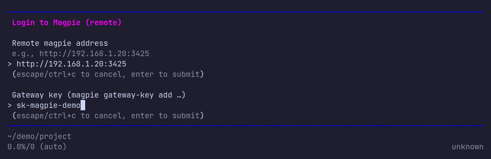
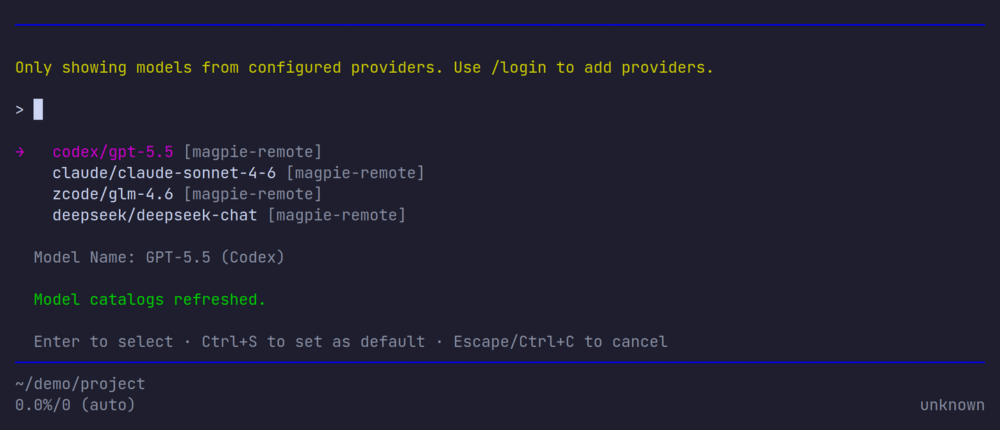
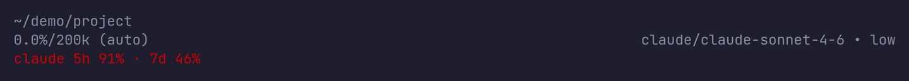
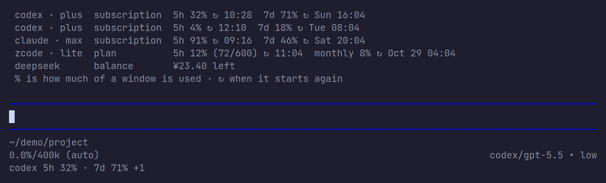

# pi-magpie-remote

让 [Pi](https://pi.dev) 使用另一台机器上运行的 [Magpie](https://github.com/yetone/magpie) 网关：通过 `/login` 填入网关地址和 gateway key，Magpie 上的模型就会出现在 Pi 的 `/model` 中，底部状态栏还会显示当前模型对应供应商的额度。

- **远程模型**：注册 `magpie-remote` 供应商，模型以 `magpie-remote/<Magpie 模型 ID>` 显示，自动按模型原生接口选择 Responses / Messages / Chat Completions，并带上推理强度（thinking level）。
- **自动刷新**：pi 启动和每次打开 `/model` 时重新拉取模型列表，远端不可达时使用本地快照。
- **额度显示**：状态栏显示当前供应商的窗口用量或余额，`/magpie-quota` 查看全部额度。
- **零依赖**：只有类型导入，运行时没有额外依赖。

## 安装

```sh
pi install git:github.com/LiangNiang/pi-magpie-remote
```

本地试用：

```sh
git clone https://github.com/LiangNiang/pi-magpie-remote
pi -e ./pi-magpie-remote
```

## 配置 Magpie

在运行 Magpie 的机器上：

1. 开启 **设置 → 局域网共享（Share on local network）**。
2. 运行 `magpie gateway-key add` 创建一个给 Pi 用的 gateway key。

记下从 Pi 所在机器能访问到的地址（例如 `http://192.168.1.20:3425`）和刚创建的 key。

## 登录

在 Pi 中运行 `/login`，选择 **Magpie (remote)**，依次输入网关地址和 gateway key。地址带不带 `/v1` 都可以。



登录成功后，连接信息和模型列表快照保存在 `~/.pi/agent/auth.json`。Pi 随后会提示该供应商还没有默认模型，用 `/model` 选择一个即可。

如果登录失败，请检查地址、网络连通性、局域网共享开关以及 gateway key 是否有效。模型列表为空时登录也会成功，远端添加模型后重新打开 `/model` 即可看到。

## 选择模型

```text
/model
```



按 Enter 选择本次会话使用的模型，按 Ctrl+S 设为默认模型。之后像平常一样发送提示即可。

## 查看额度

选中 `magpie-remote` 模型后，Pi 底部状态栏最后一行会显示该模型所属供应商在 Magpie 上的额度：

- 订阅 / 套餐显示各窗口已用百分比，例如 `codex 5h 32% · 7d 71%`；
- 按量付费的 key 显示余额，例如 `deepseek ¥23.40`；
- 同一供应商有多个账号时，优先显示最近一次经网关服务的账号，`+N` 表示还有 N 个账号。

用量达到 75% 时变黄，达到 90% 时变红：



状态会在 pi 启动、切换模型以及每次回复结束后刷新（最多每分钟拉取一次）。

查看全部供应商的额度，或只看某个供应商：

```text
/magpie-quota
/magpie-quota codex
```



输出与 Magpie 机器上 `magpie quota` 一致：每个订阅、套餐各窗口的用量和重置时间（↻），以及各 key 的余额。数据来自网关的 `GET /v1/magpie/quotas`，使用 `/login` 时保存的地址和 gateway key，因此同样需要开启局域网共享。

> 截图中的模型和额度为演示数据。

## 开发

```sh
npm install
npm run check   # 类型检查
npm test        # 单元测试
```

对正在使用的 Magpie 做只读冒烟测试（拉取模型列表和额度，不发起对话，不消耗额度）：

```sh
MAGPIE_URL=http://192.168.1.20:3425 MAGPIE_GATEWAY_KEY=sk-magpie-... npm run smoke
```

未设置 `MAGPIE_URL` 时冒烟测试会跳过。
